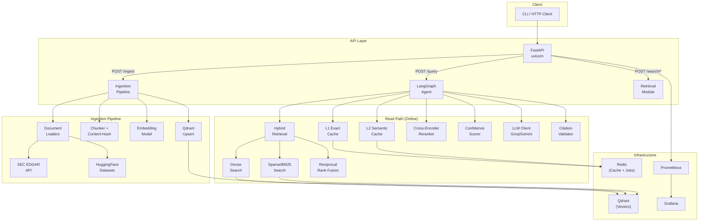
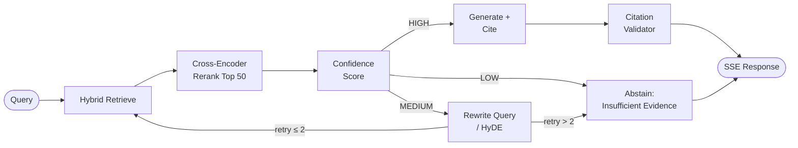
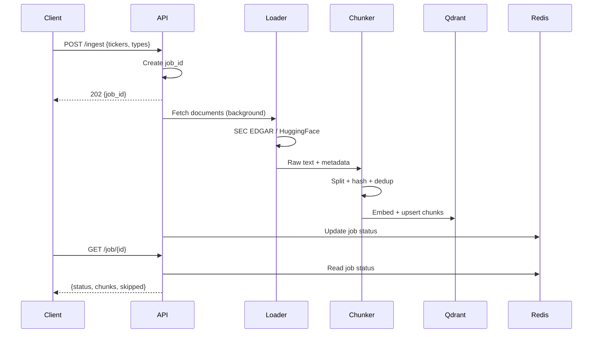

# Architecture

## System Overview

```mermaid
graph TB
    subgraph "Client"
        CLI["CLI / HTTP Client"]
    end

    subgraph "API Layer"
        FE["FastAPI<br/>uvicorn"]
        FE -->|POST /ingest| ING["Ingestion<br/>Pipeline"]
        FE -->|POST /query| AGENT["LangGraph<br/>Agent"]
        FE -->|POST /search/*| RET["Retrieval<br/>Module"]
    end

    subgraph "Ingestion Pipeline"
        ING --> LOAD["Document<br/>Loaders"]
        LOAD --> EDGAR["SEC EDGAR<br/>API"]
        LOAD --> HF["HuggingFace<br/>Datasets"]
        ING --> CHUNK["Chunker +<br/>Content Hash"]
        ING --> EMBED["Embedding<br/>Model"]
        ING --> UPSERT["Qdrant<br/>Upsert"]
    end

    subgraph "Read Path (Online)"
        AGENT --> L1["L1 Exact<br/>Cache"]
        AGENT --> L2["L2 Semantic<br/>Cache"]
        AGENT --> HYBRID["Hybrid<br/>Retrieval"]
        HYBRID --> DENSE["Dense<br/>Search"]
        HYBRID --> SPARSE["Sparse/BM25<br/>Search"]
        HYBRID --> RRF["Reciprocal<br/>Rank Fusion"]
        AGENT --> RERANK["Cross-Encoder<br/>Reranker"]
        AGENT --> CONF["Confidence<br/>Scorer"]
        AGENT --> LLM_CLIENT["LLM Client<br/>Groq/Gemini"]
        AGENT --> CITE["Citation<br/>Validator"]
    end

    subgraph "Infrastructure"
        QDRANT["Qdrant<br/>(Vectors)"]
        REDIS["Redis<br/>(Cache + Jobs)"]
        PROM["Prometheus"]
        GRAF["Grafana"]
    end

    CLI --> FE
    UPSERT --> QDRANT
    DENSE --> QDRANT
    SPARSE --> QDRANT
    L1 --> REDIS
    L2 --> REDIS
    FE --> PROM
    PROM --> GRAF
```

## Agent Decision Loop (Day 7)

```mermaid
graph LR
    START([Query]) --> RETRIEVE[Hybrid Retrieve]
    RETRIEVE --> RERANK[Cross-Encoder<br/>Rerank Top 50]
    RERANK --> SCORE[Confidence<br/>Score]
    SCORE -->|HIGH| GENERATE[Generate +<br/>Cite]
    SCORE -->|MEDIUM| REWRITE[Rewrite Query<br/>/ HyDE]
    SCORE -->|LOW| ABSTAIN[Abstain:<br/>Insufficient Evidence]
    REWRITE -->|retry ≤ 2| RETRIEVE
    REWRITE -->|retry > 2| ABSTAIN
    GENERATE --> VALIDATE[Citation<br/>Validator]
    VALIDATE --> RESPOND([SSE Response])
    ABSTAIN --> RESPOND
```

## Data Flow: Ingestion

```mermaid
sequenceDiagram
    participant Client
    participant API
    participant Loader
    participant Chunker
    participant Qdrant
    participant Redis

    Client->>API: POST /ingest {tickers, types}
    API->>API: Create job_id
    API-->>Client: 202 {job_id}
    API->>Loader: Fetch documents (background)
    Loader->>Loader: SEC EDGAR / HuggingFace
    Loader->>Chunker: Raw text + metadata
    Chunker->>Chunker: Split + hash + dedup
    Chunker->>Qdrant: Embed + upsert chunks
    API->>Redis: Update job status
    Client->>API: GET /job/{id}
    API->>Redis: Read job status
    API-->>Client: {status, chunks, skipped}
```
